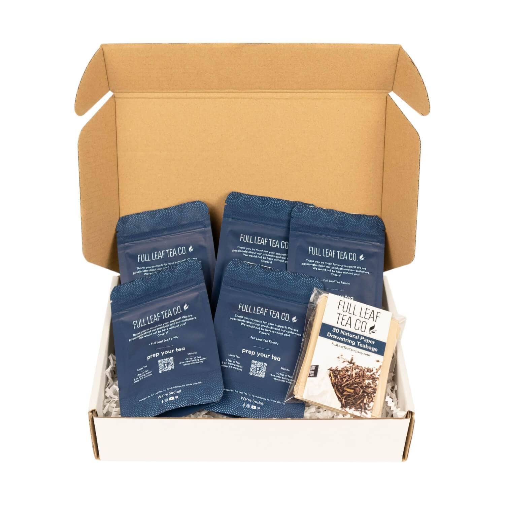
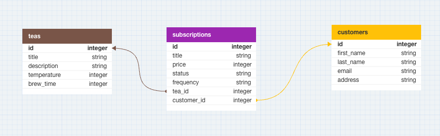

<!-- PROJECT LOGO -->
<br />
<div align="center">
  <a href="SubscriptionBox_1.jpg">
    
  </a>

<h3 align="center">Tea-scription</h3>

  <p align="center">
    My Mod 4 take home challenge. An API application to help to manage subscriptions, customers, and teas for your tea company.
    <br />
    <a href="https://github.com/sgwalker327/tea-scription/issues">Report Bug</a>
    ·
    <a href="https://github.com/sgwalker327/tea-scription/issues">Request Feature</a>
  </p>
</div>

# Tea-scription
This is an API to manage customer subscriptions for a subscription tea service.

## About The Project

The Tea-scription API was developed as part of the curriculum at Turing School of Software and Design. The project aims to assess the following learning goals:

1. **Strong Understanding of Rails:** The project emphasizes the use of Rails, a popular web application framework, to build a robust API. By implementing this project, developers gain hands-on experience in utilizing Rails' powerful features and conventions.

2. **Creating Restful Routes:** Restful routes play a crucial role in designing well-structured APIs. In this project, developers are expected to create endpoints that follow RESTful principles, ensuring clarity, consistency, and ease of use for API consumers.

3. **Demonstration of Well-Organized Code (OOP):** Object-Oriented Programming (OOP) is a fundamental concept in software development. The project encourages developers to showcase their ability to write clean, organized, and maintainable code, leveraging OOP principles to enhance the structure and readability of their implementation.

4. **Test-Driven Development (TDD):** Test-driven development is an essential practice in modern software engineering. Throughout this project, developers are encouraged to follow TDD principles by writing tests before implementing the corresponding functionality. This approach ensures the reliability and stability of the API while facilitating code maintainability and extensibility.

5. **Clear Documentation:** Effective documentation is a vital aspect of any software project. By providing clear and comprehensive documentation, developers demonstrate their ability to communicate their work effectively to other developers and stakeholders. This project emphasizes the importance of documenting the API's endpoints, expected request/response formats, and any necessary setup steps.

### Built With


## Getting Started

Below you will see a list of prerequisites and steps to install and use this API.

### Prerequisites

You must have the following software installed on your system:

* [Ruby](https://www.ruby-lang.org/en/downloads/)
* [Rails](https://guides.rubyonrails.org/getting_started.html)
* [Bundler](https://bundler.io/)
* [PostgreSQL](https://www.postgresql.org/download/)

### Installation

1. Clone repository to local machine
2. Install gems. Run ` bundle  install ` in you console.
4. Create, migrate, and seed database by running ` rails db:{create,migrate,seed} ` in your console.

## Testing
1. After bundling, run  ` bundle exec rspec ` to run test suite

## Usage

1. Run local server using ` rails s `
2. Use postman/browser to reach endpoints described below

## Endpoints
1. Create a user subscription:
POST /api/v1/customers/:id/subscriptions
request: POST `/api/v1/customers/1/subscriptions w/ subscription params`
response:
``` 
{
    "data": {
        "id": "10",
        "type": "subscription",
        "attributes": {
            "title": "Green Tea Everyday",
            "price": 14.5,
            "frequency": "monthly",
            "status": "active",
            "tea_id": 1,
            "customer_id": 1
        }
    }
}
```

2. Update status of subscription:
PUT /api/v1/customers/:id/subscriptions/:id
request: PUT `/api/v1/customers/1/subscriptions/1`
response:
 ```
 {
    "data": {
        "id": "1",
        "type": "subscription",
        "attributes": {
            "title": "Green Tea Everyday",
            "price": 14.5,
            "frequency": "weekly",
            "status": "active",
            "tea_id": 1,
            "customer_id": 1
        }
    }
} 
```
3. Get all customer subecriptions (active & canceled):
GET /api/v1/customers/:id/subscriptions
request: GET `/api/v1/customers/1/subscriptions`
response:
```
 {
    "data": [
        {
            "id": "1",
            "type": "subscription",
            "attributes": {
                "title": "Green Tea Everyday",
                "price": 14.5,
                "frequency": "weekly",
                "status": "cancelled",
                "tea_id": 1,
                "customer_id": 1
            }
        },
        {
            "id": "4",
            "type": "subscription",
            "attributes": {
                "title": "Everyday Earl",
                "price": 15.0,
                "frequency": "weekly",
                "status": "active",
                "tea_id": 2,
                "customer_id": 1
            }
        },
        {
            "id": "7",
            "type": "subscription",
            "attributes": {
                "title": "Black Tea Pretty Frequently",
                "price": 11.5,
                "frequency": "biweekly",
                "status": "active",
                "tea_id": 3,
                "customer_id": 1
            }
        }
    ]
} 
```

## Schema


## Contact

Sam Walker –  sgwalker327@gmail.com

[https://github.com/sgwalker327/tea-scription](https://github.com/sgwalker327/tea-scription)

## Contributing

1. Fork it (<https://github.com/sgwalker327/tea-scription/fork>)
2. Create your feature branch (`git checkout -b feature/fooBar`)
3. Commit your changes (`git commit -am 'Add some fooBar'`)
4. Push to the branch (`git push origin feature/fooBar`)
5. Create a new Pull Request
